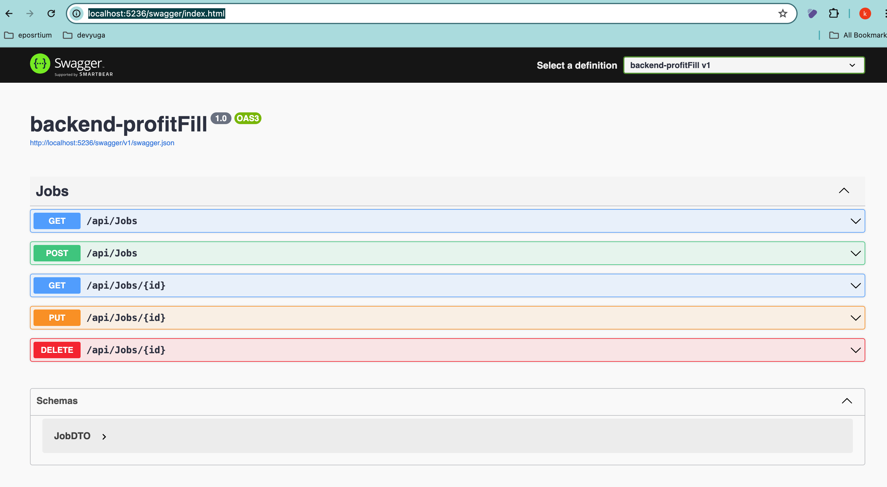

# ProfitFill App

### With Docker

You need docker installed to run the app. Run the following command in the root destination where docker-compose.yaml exists.

`docker-compose up --build`

Wait till it finished building, and in the browser go to the following url.

`http://localhost:3000/`

You could access the backend api's through swagger api's running in the following address.

`http://localhost:5236/swagger/index.html`

The swagger api ui looks like this.

---

### Without Docker

Without docker, you need following frameworks/sdk/tools installed.

1. Dotnet 8.0
2. Nodejs
3. Ef core globally
4. Postgres

#### Backend

When installed, update connection string in appsettings.json in backend with yours, then run the following command for db update from migration files.

`dotnet ef database update`

Install dependencies: `dotnet restore`.
To run the app: `dotnet run`

#### frontend

If node is installed, fromt the frontend-profitfill folder,

`npm install` and then `npm run`.
